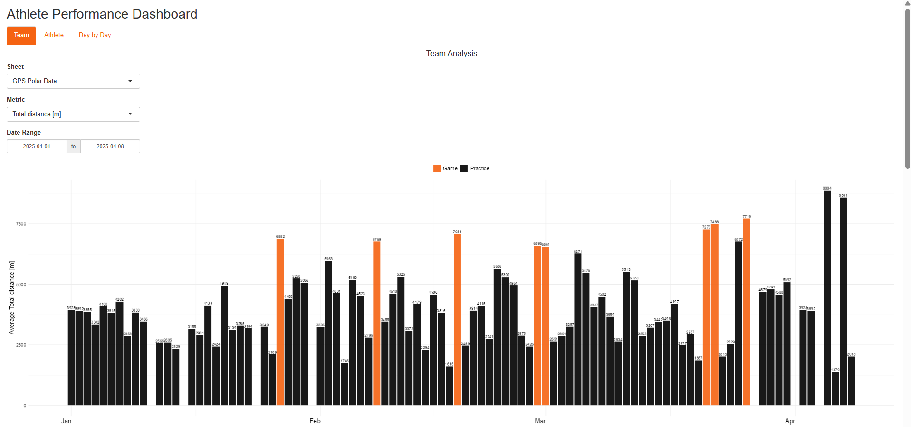
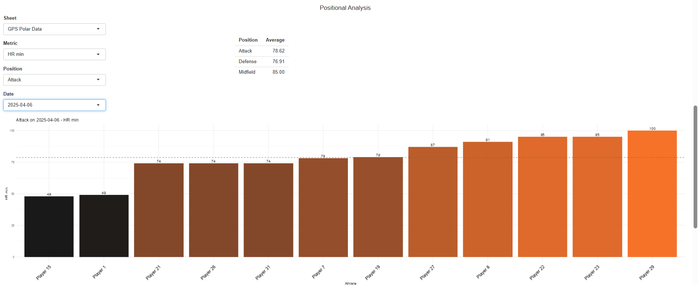
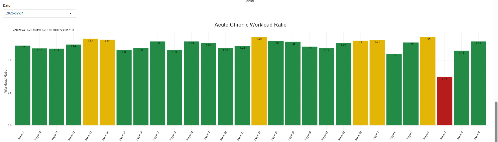
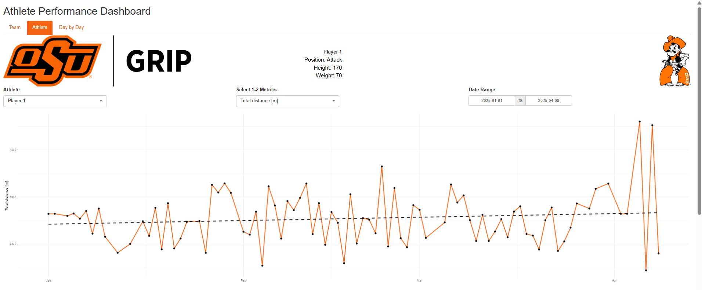
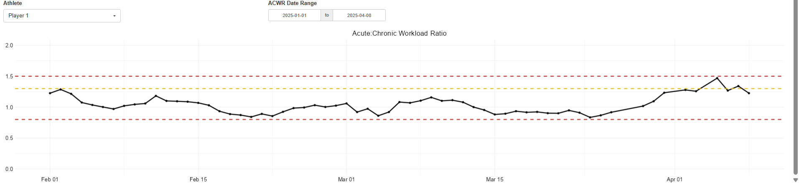
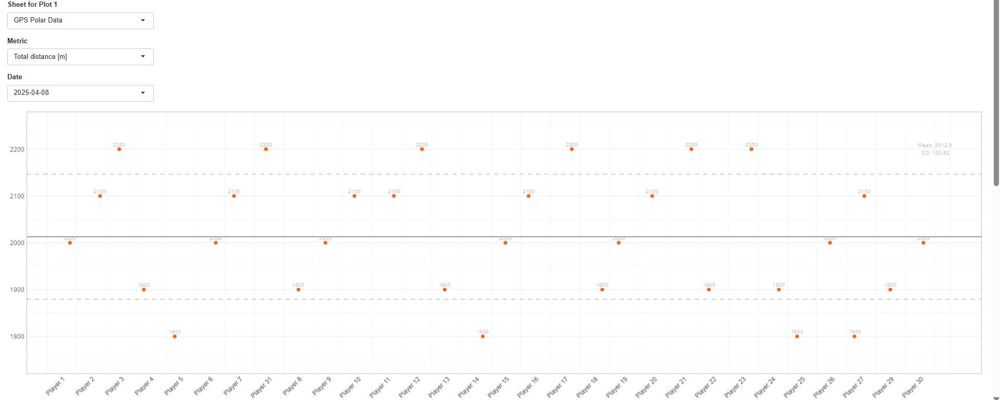

# Athlete Performance Dashboard

## Overview
This project is an interactive Shiny dashboard designed to provide coaching staff with an accessible view of team, positional, and individual athlete data. The dashboard brings multiple performance and monitoring data sources together into one interface that can be updated quickly and reviewed in real time.

## Problem
Coaching staff needed an interactive and easy-to-access view of team, positional, and individual athlete data that could be updated rapidly and used to support day-to-day and longer-term decision-making.

## Data
- GPS metrics
- Jump testing data
- Athlete wellness questionnaire data
- Additional performance testing data

## Tools
- R
- ggplot2
- dplyr
- tidyr
- lubridate
- readxl
- Shiny
- shinyWidgets
- DT

## Outcome
Developed a multi-tab Shiny application that displays workload data, wellness visualizations, positional comparisons, and athlete-specific time-series views in one interactive dashboard.

## Applied Use
- Provides a quick and accessible reference for performance, workload, and wellness data in one location.
- Supports timely decision-making through an interface that can be updated rapidly as new data become available.
- Can be used during weekly staff meetings, to inform return-to-play protocols, to monitor athlete progress, and to support periodization decisions.

