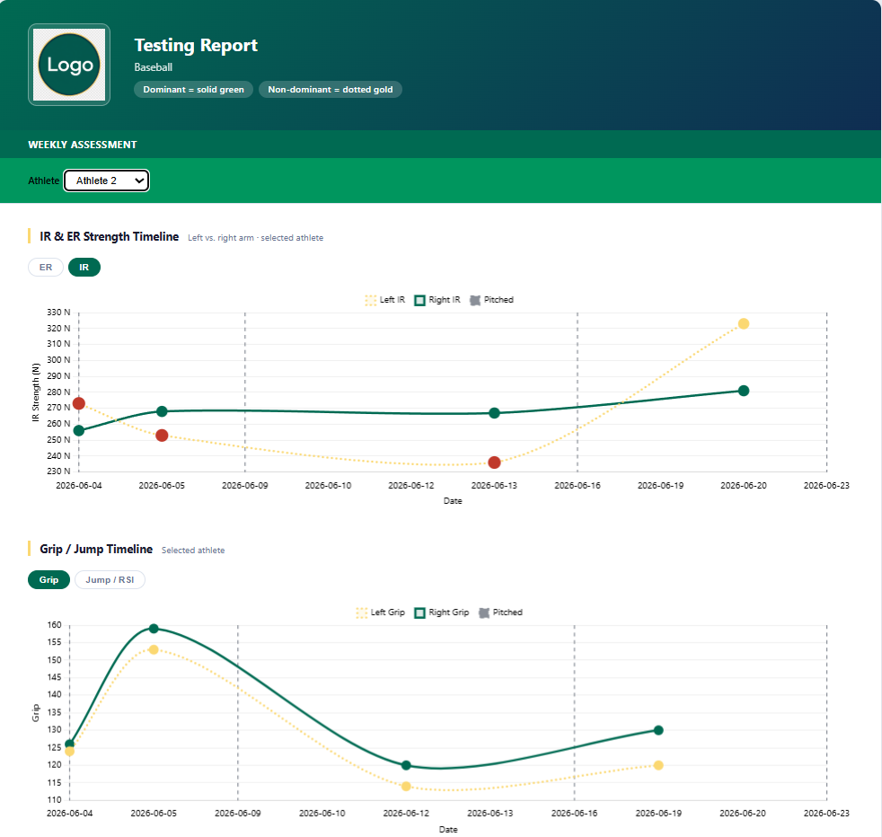
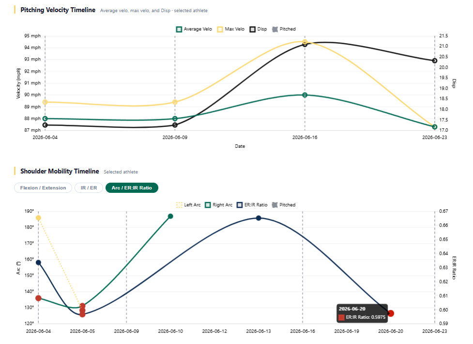
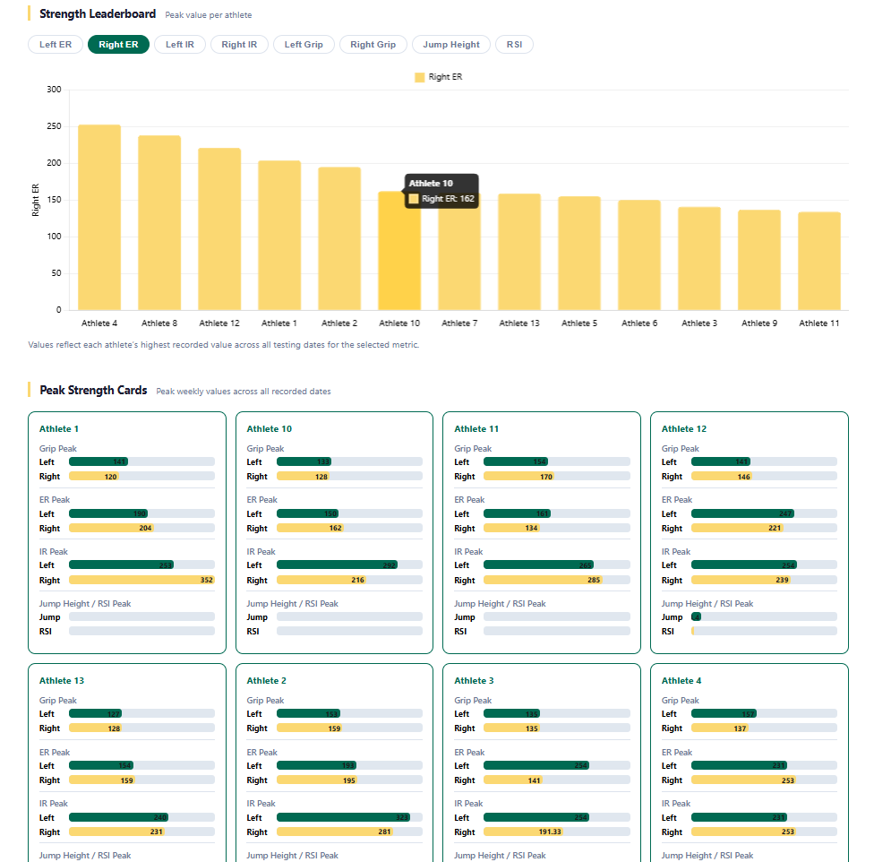
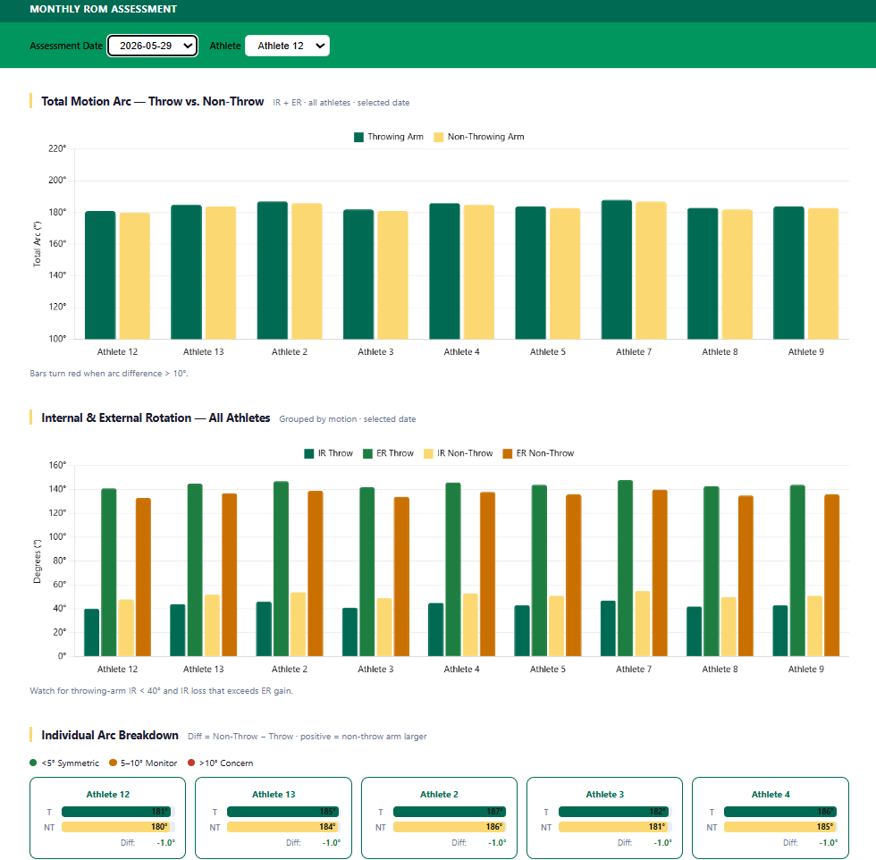
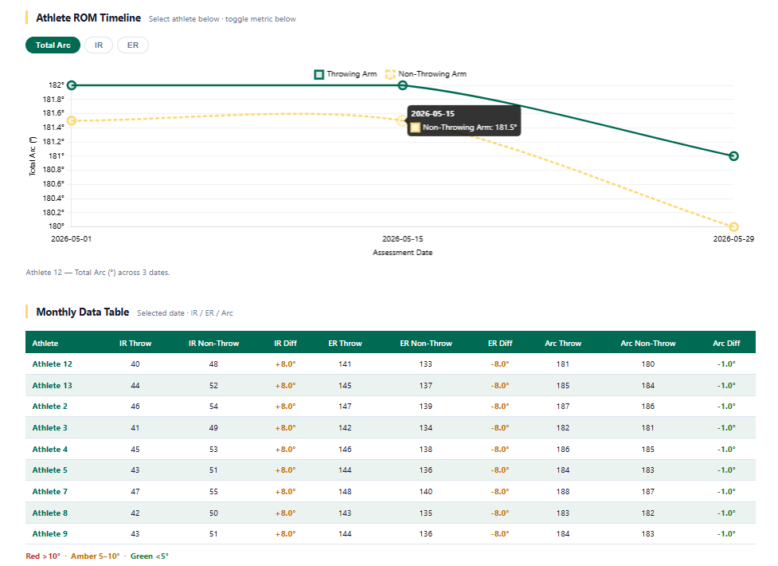

# Dynamic HTML Athlete Monitoring Report

## Overview
This project is a dynamic HTML athlete monitoring report built to display weekly assessment and monthly range-of-motion testing data in an interactive, coach-friendly format. 
The report combines HTML, CSS, JavaScript, and Chart.js with R-generated data exports to create a portable report that can be shared and viewed in a browser. 

## Purpose
The goal of this project was to improve how data are communicated to coaches and staff. 
Instead of relying on static spreadsheets or in depth dashboards, this report organizes multiple testing domains into a simple interactive format that allows staff to review trends, compare sides, and identify potential red flags more efficiently. 

## Data Included
The report is designed to display multiple athlete monitoring data streams, including:

- Weekly assessment data
- Monthly shoulder range-of-motion data
- Strength testing data
- Grip strength and jump testing data
- Pitching velocity data
- Cervical mobility data
- Balance and mobility data
- Apley and torso rotation data
- Pitching schedule data

## Features
Key features of the report include:

- Athlete selection dropdowns for individual review
- Assessment date filters for monthly ROM analysis
- Interactive tabbed metric views
- Chart.js time-series visualizations
- Throwing vs. non-throwing arm comparisons
- Peak strength leaderboards
- Individual athlete summary cards
- Threshold-based color coding for monitoring concerns
- Embedded data tables for side-to-side comparison
- Portable browser-based reporting without requiring a dashboard server

## Tools Used
- R
- HTML
- CSS
- JavaScript
- Chart.js 

## How It Works
The report template uses placeholder fields such as report title, team label, threshold values, and embedded JSON data objects. These placeholders can be filled programmatically from R so that a fresh HTML report can be generated for a specific team, date range, or testing cycle.

The final output is a browser-viewable report that allows users to move between sections such as weekly assessment, monthly ROM assessment, strength trends, velocity trends, and athlete-specific timelines. This makes the report useful for staff meetings, athlete reviews, and ongoing monitoring workflows.

## Example Sections
The report includes sections such as:

- Internal and external strength timeline
- Grip and jump timeline
- Pitching velocity timeline
- Shoulder mobility timeline
- Cervical timeline
- Balance and mobility timeline
- Apley and torso rotation timeline
- Strength leaderboard
- Peak strength cards
- Monthly ROM data table

## Practical Value
This project demonstrates how athlete monitoring data can be translated into a practical decision-support tool for sports performance settings. It shows the ability to connect data processing in R with front-end reporting tools that improve communication, usability, and applied interpretation for coaches and practitioners. 

